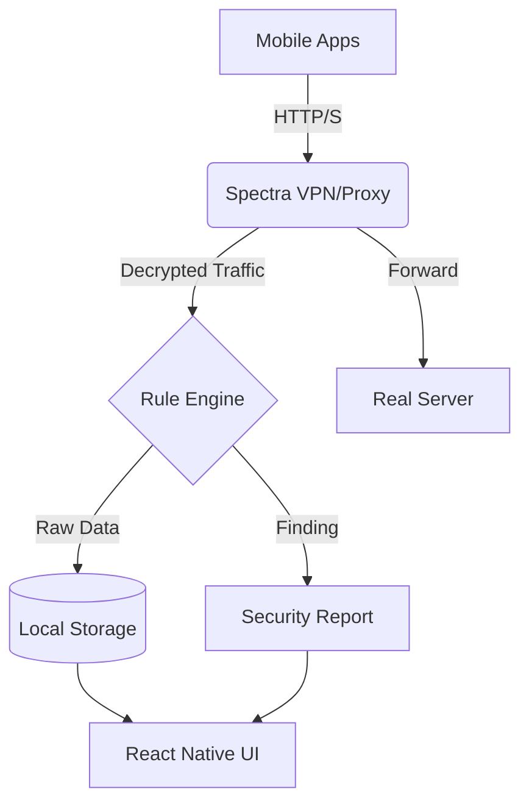

<!-- START doctoc generated TOC please keep comment here to allow auto update -->
<!-- DON'T EDIT THIS SECTION, INSTEAD RE-RUN doctoc TO UPDATE -->
## 📋 Table of Contents

- [🛡️ Spectra](#-Spectra)
  - [✨ Key Features](#-key-features)
  - [🏗️ Architecture](#-architecture)
  - [🛠️ Tech Stack](#-tech-stack)
  - [🚀 Getting Started](#-getting-started)
    - [Prerequisites](#prerequisites)
    - [Installation](#installation)
    - [Running the App](#running-the-app)
  - [🛡️ Security Rules Progress](#-security-rules-progress)
  - [Request Rules](#request-rules)
  - [Response Rules](#response-rules)
  - [Header Rules](#header-rules)
  - [JWT Rules](#jwt-rules)
  - [Cookie Rules](#cookie-rules)
  - [TLS Rules](#tls-rules)
  - [📁 Project Structure](#-project-structure)
  - [📜 License](#-license)

<!-- END doctoc generated TOC please keep comment here to allow auto update -->

# 🛡️ Spectra

[](https://github.com/yourusername/Spectra)
[](https://opensource.org/licenses/MIT)
[](https://www.typescriptlang.org/)
[](https://reactnative.dev/)
[](FUNCTIONS_PROGRESS.md)

**Spectra** is a no-root mobile HTTP traffic inspector and passive security scanner for Android and iOS. Built with React Native, it combines a local MitM proxy with a powerful security rule engine to identify vulnerabilities in mobile app traffic in real-time.

<!-- START-GIT-RECO-LIST -->
<!-- TOC -->
<!-- END-GIT-RECO-LIST -->

---

## ✨ Key Features

- **No-Root Capture**: Android `VpnService` and iOS `NetworkExtension` integration.
- **SSL/TLS Interception**: Dynamic certificate generation and signing for HTTPS decryption.
- **Passive Scanner**: Real-time rule engine that detects 26+ security issues (API keys, PII leaks, JWT flaws, etc.).
- **Security Dashboard**: Clean UI for inspecting requests, responses, and security findings.
- **Interoperability**: Export captured traffic in HAR 1.2 format for Burp Suite or Postman.

---

## 🏗️ Architecture



---

## 🛠️ Tech Stack

| Layer | Technology |
|---|---|
| **Frontend** | React Native (TypeScript), React Navigation 7, Zustand |
| **Android Engine** | Kotlin, VpnService, OkHttp |
| **iOS Engine** | Swift, NetworkExtension (NEAppProxyProvider) |
| **Rule Engine** | TypeScript (JS Thread) |
| **Storage** | MMKV (Fast KV), Expo SQLite (Structured) |

---

## 🚀 Getting Started

### Prerequisites
- Node.js (v18+)
- Android SDK / Xcode
- Yarn or npm

### Installation
```bash
# Clone and install backend
git clone https://github.com/millareskenneth/Spectra.git
cd Spectra && npm install

# Clone and install frontend (in a sibling directory)
cd ..
git clone https://github.com/millareskenneth/it-asset-inventory-mobile.git "Spectra Frontend"
cd "Spectra Frontend" && npm install
```

### Running the App
Refer to the README in each subdirectory for specific instructions.

---

## 🛡️ Security Rules Progress

Below is the current status of the security rule implementation. This section is updated automatically.

<!-- START-RULES-PROGRESS -->

## Request Rules
- [x] REQ-001: API key or secret in URL query parameter
- [x] REQ-002: Password in URL query parameter
- [x] REQ-003: AWS credential pattern detected
- [x] REQ-004: Authorization token sent over plain HTTP
- [x] REQ-005: Private key pattern in request body

## Response Rules
- [x] RES-001: Stack trace in response body
- [x] RES-002: Internal server paths exposed
- [ ] RES-003: Auth endpoint returns sensitive fields
- [ ] RES-004: Response contains excessive user PII
- [ ] RES-005: DB internals leaked
- [ ] RES-006: Server technology fingerprint
- [ ] RES-007: Response returns full DB row on login/profile

## Header Rules
- [ ] HDR-001: Missing HSTS
- [ ] HDR-002: Missing CSP
- [ ] HDR-003: Missing X-Content-Type-Options
- [ ] HDR-004: Missing X-Frame-Options
- [ ] HDR-005: X-Powered-By or Server header reveals stack

## JWT Rules
- [ ] JWT-001: alg: none
- [ ] JWT-002: missing exp claim
- [ ] JWT-003: sensitive PII in payload
- [ ] JWT-004: sent over plain HTTP

## Cookie Rules
- [ ] COK-001: missing Secure flag
- [ ] COK-002: missing HttpOnly flag
- [ ] COK-003: missing SameSite attribute

## TLS Rules
- [ ] TLS-001: HTTPS endpoint falls back to HTTP redirect
- [ ] TLS-002: Certificate pinning detected


<!-- END-RULES-PROGRESS -->

---

## 📁 Project Structure

```
Spectra/              # Backend Repository
├── src/              # Source code
├── scripts/          # Automation scripts
├── package.json      # Backend dependencies
└── README.md         # This file

Spectra Frontend/     # Frontend Repository (Sibling Directory)
└── ...               # React Native Project
```

---

## 📜 License

This project is licensed under the MIT License - see the [LICENSE](LICENSE) file for details.
